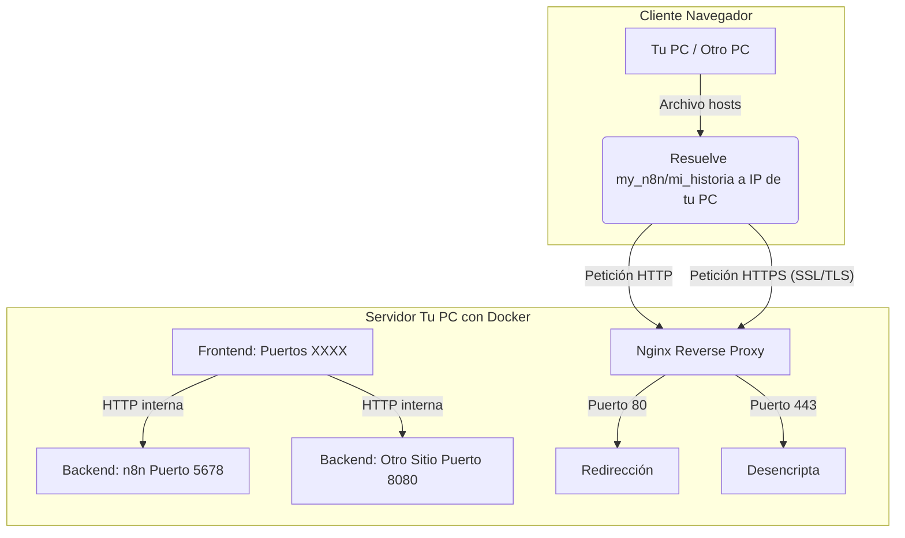

# Mi Proxy Inverso con Nginx

Este proyecto utiliza Docker Compose para configurar un proxy inverso con Nginx,
gestionando el tráfico a varias aplicaciones locales y proporcionando cifrado SSL/TLS.

## Arquitectura del Proxy Inverso con SSL/TLS



### Cómo Iniciar

1.  Asegúrate de que tus aplicaciones (`n8n`, `mi_historia`) estén corriendo en los puertos `5678` y `8080` de tu máquina.
2.  Edita tu archivo `hosts` (y el de cualquier otra PC que quiera acceder) para mapear `my_n8n` y `mi_historia` a la IP de tu PC. Por ejemplo:
    ```
    192.168.0.66   my_n8n
    192.168.0.66   mi_historia
    ```
3.  Desde la raíz de este proyecto, ejecuta:
    ```bash
    docker compose up -d --build
    ```
4.  Accede a tus aplicaciones vía HTTPS:
    *   `https://my_n8n`
    *   `https://mi_sitio`
    *(Recuerda aceptar la advertencia de certificado autofirmado en tu navegador la primera vez).*

## Generación de Certificados SSL/TLS Autofirmados

Si necesitas generar nuevos certificados, sigue estos pasos:

1.  Asegúrate de tener `openssl` instalado en tu sistema.
2.  Desde la raíz del proyecto, crea el directorio para los certificados si no existe:
    ```bash
    mkdir -p nginx_certs
    ```
3.  Ejecuta el siguiente comando para generar la clave privada y el certificado:
    ```bash
    openssl req -x509 -nodes -days 365 -newkey rsa:2048 \
      -keyout nginx_certs/self-signed.key \
      -out nginx_certs/self-signed.crt \
      -subj "/C=ES/ST=Madrid/L=Madrid/O=MiEmpresa/OU=Desarrollo/CN=mi_reverse_proxy"
    ```

    *   `days 365`: El certificado será válido por un año.
    *   `subj`: Rellena los detalles del certificado. Puedes personalizarlos según necesites. `CN` (Common Name) es el más importante y debería coincidir con el dominio que estás asegurando, aunque para desarrollo local con múltiples dominios no es crítico.

4.  Los archivos `self-signed.key` (clave privada) y `self-signed.crt` (certificado público) se crearán en el directorio `nginx_certs/`.